# Mavu / Luno Demo Wallet App

This repository contains a demo wallet application showcasing payments, QR codes, facial verification (DeepFace), voice assistant integrations, notifications, and administrative tooling used for testing and onboarding. The app is a mix of Node.js backend, frontend views, and optional Python microservices used for face recognition.

---

**Quick links**
- Project root: [README.md](README.md)
- Server entry: [server.js](server.js#L1)
- DeepFace microservice: [start_deepface_api.py](start_deepface_api.py)
- Start scripts: `start-app.bat`, `start-voice-service.bat`

---

## Features
- User authentication and session handling
- Send and receive money (manual and QR-code driven)
- Camera-based face verification (DeepFace integration)
- Voice assistant and voice-AI service hooks
- Transaction history, budgets and daily limits system
- In-app notifications and settings management
- Password reset and security-questions flows
- Developer tools for testing (debug scripts in repo)

---

## Prerequisites
- Node.js (14+ recommended)
- npm (or yarn)
- Python 3.8+ (optional, for DeepFace microservice)
- A database (see setup scripts in `scripts/` and `setup-*` files)

Environment variables are provided in `env.example`. Copy it to `.env` and update values before running.

---

## Quick Setup
1. Install dependencies:

```bash
npm install
```

2. Create `.env` from `env.example` and configure DB and API keys.

3. Initialize the database (examples included in repo):

```bash
node setup-database.js
node setup-qr-codes.js
node setup-settings-tables.js
```

4. Start services:
- Start the main server (or use the provided bat/sh scripts):

```bash
node server.js
# or on Windows
start-app.bat
```

- If you use face verification, start the DeepFace API (Python):

```bash
python start_deepface_api.py
```

---

## Running the Voice Assistant / AI
Voice/AI services are available in `voice_ai_service/` and have scripts to start them. Use the bat/sh scripts like `start-voice-service.bat` or `start-gemini-voice.bat` for convenience.

---

## Testing and Debugging
- Unit and manual debug utilities are in `test-*` and `debug-*` files (e.g., `debug-send-money.js`, `test-notification-fix.js`).
- Use `start-server-debug.bat` to run with debug flags.

---

## Sample Images / UI Gallery
Below are the sample screenshots included in `sample images/`. Each image shows a UI screen and a short note on how to interact with that part of the app.

1.

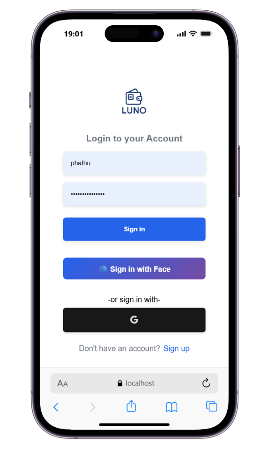

Description: Home dashboard showing account balance and quick actions. Interact by clicking **Send**, **Request**, or **QR** buttons. Use the top menu to navigate to `Transactions`, `Budgets`, and `Settings`.

2.

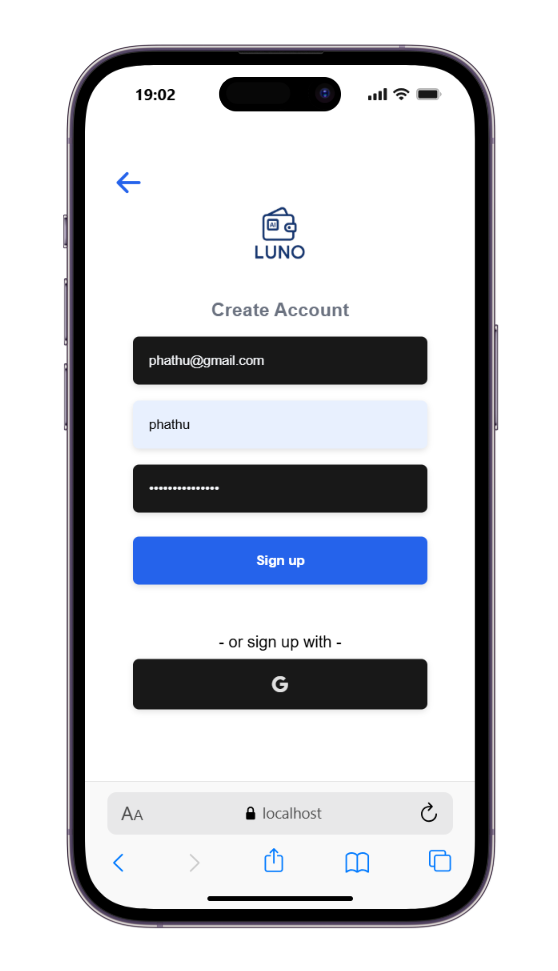

Description: Send Money screen. Enter recipient phone/email or scan a QR code, type amount, and confirm. The app will show the transaction preview and request PIN or face verification if enabled.

3.

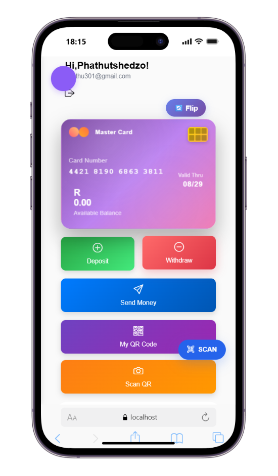

Description: QR payment flow. Tap **Scan QR** to open the camera, align the QR inside the frame, and confirm payment details once decoded.

4.

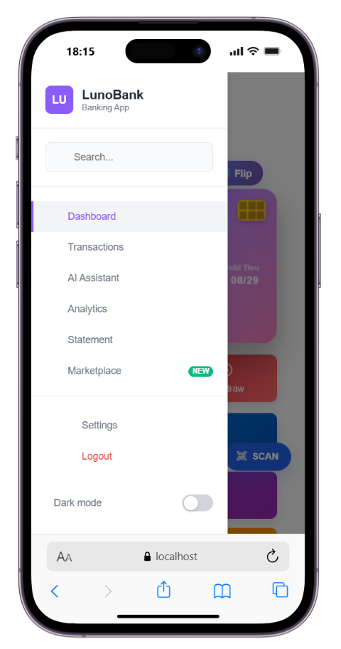

Description: Face verification request. Allow camera access when prompted. Hold your face steady and follow on-screen guidance until capture completes.

5.

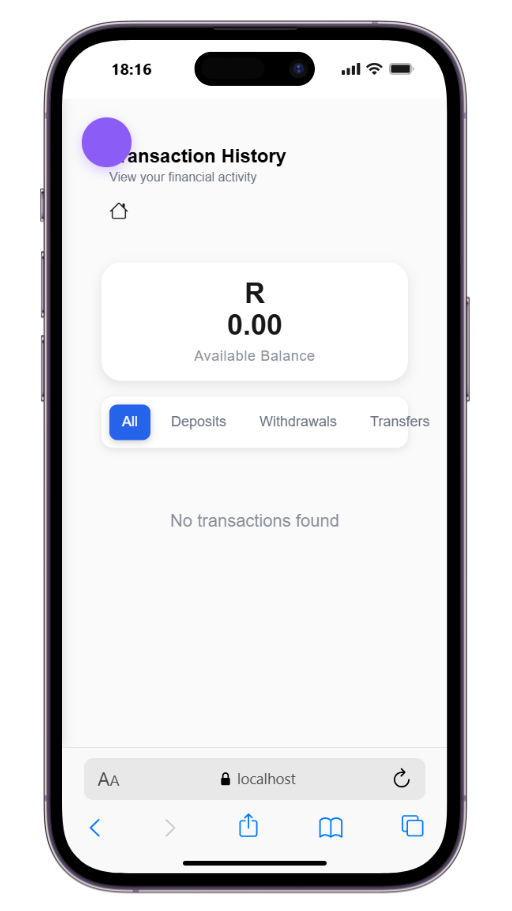

Description: Face capture success and verification in progress. The UI shows a progress indicator; wait for the verification result (success/failure).

6.

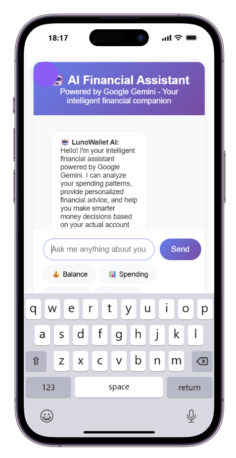

Description: Verification result and confidence score from the DeepFace microservice. When verified, the transaction proceeds; on failure, the user may retry or use an alternate auth method.

7.

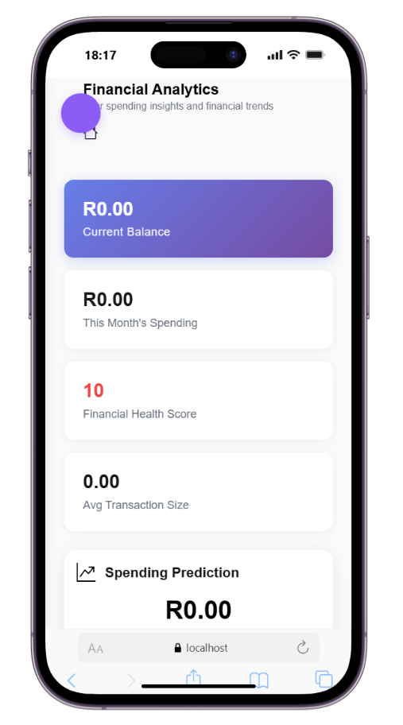

Description: Transaction history list. Tap any entry to view details, dispute, or repeat payment. Use filters to find transactions by date or type.

8.

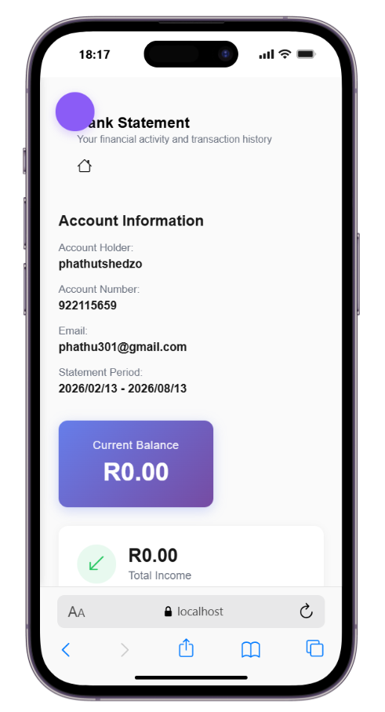

Description: In-app notifications center. Swipe or click a notification to mark it read. Notification examples: payment received, failed transfer, verification required.

9.

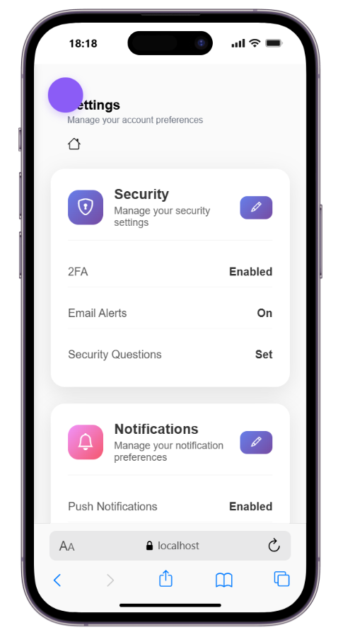

Description: Voice assistant UI. Tap the microphone button and speak commands like "Send 50 to Alice" or "Show my recent transactions." Ensure microphone permissions are granted.

10.

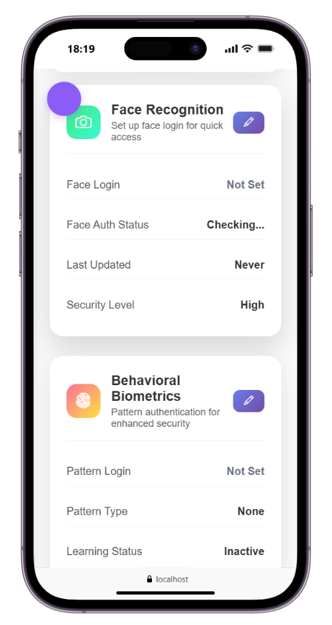

Description: Settings screen where users manage security questions, change PIN, toggle face/voice auth, and configure notification preferences.

11.

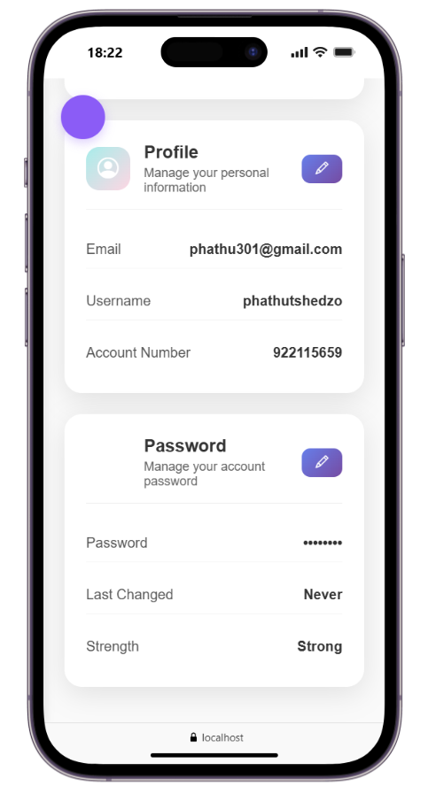

Description: Daily limits and budgeting dashboard. Adjust monthly budgets and view spending categories. Alerts are triggered when approaching limits.

---

## Recommended Next Steps
- Verify `.env` values and start the database.
- Start the DeepFace microservice if you plan to use face verification.
- Test the `debug-send-money.js` script to confirm transaction flows in a sandbox.

---

## Contributing
Contributions, bug reports, and feature requests are welcome. Please open issues and submit pull requests with clear descriptions and test steps.


